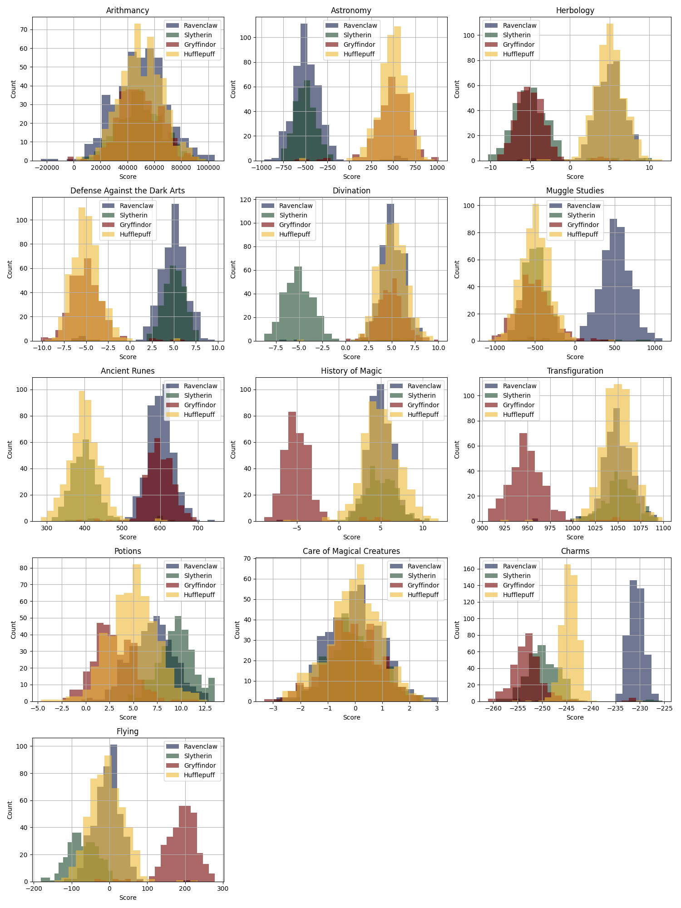
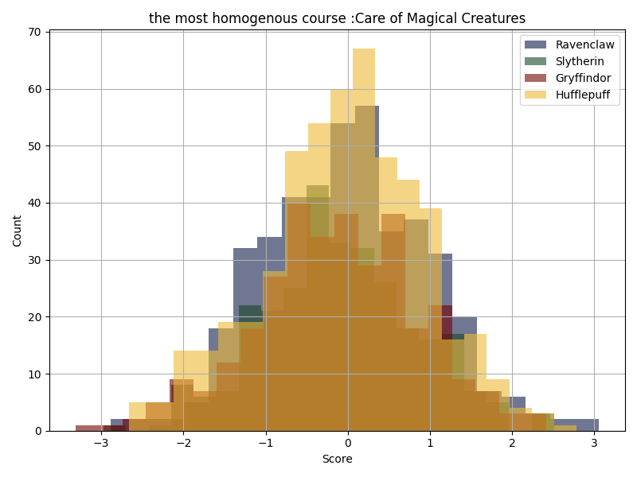

# DSLR_Dumbledore-s_Spell_for_Legendary_Results
DataScience Logistic Regression

## Project Overview
This project introduces data science concepts and logistic regression in a playful Harry Potter-themed scenario. You'll analyze and visualize data, then build a multi-class logistic regression classifier to replicate the Sorting Hat.

## Usage

To install the requirements do this in your terminal
```bash
>> ./setup.sh
```

##  Objectives

- Explore and clean a dataset.
- Visualize features to uncover relationships and patterns.
- Train a multi-class logistic regression classifier using gradient descent.
- Predict house assignments for new students with at least **98% accuracy**.

## Project structure

```bash
.
├── describe.py             # Analyze and summarize dataset (no built-in functions)
├── histogram.py            # Plot histograms per house per course
├── scatter_plot.py         # Create a scatter plot of two most similar features
├── pair_plot.py            # Visualize feature correlations across dataset
├── logreg_train.py         # Train one-vs-all logistic regression model
└── logreg_predict.py       # Predict Hogwarts house using trained model
```
---

## Mandatory

### 1. Data Analysis

Script describe.py that calculates summary statistics manually:
- Count, Mean, Std, Min, 25%, 50%, 75%, Max

### 2. Data Visualization

- ``histogram.py``: Identify which Hogwarts course has a homogeneous score distribution between houses.
- ``scatter_plot.py``: Find and visualize the two most similar features.
- ``pair_plot.py``: Create a pair plot to choose the best features for logistic regression.

#### histogram

_Which Hogwarts course has a homogeneous score distribution between all four houses?_

We can answerd with the [test of Levene](https://en.wikipedia.org/wiki/Levene%27s_test)



### 3. Logistic Regression
- ``logreg_train.py``: Train using one-vs-all strategy and gradient descent. Save learned weights.
- ``logreg_predict.py``: Predict houses from ``dataset_test.csv`` using saved weights.

## Math Reference
Cost function:

```bash
J(θ) = −(1/m) ∑ [ y(i) log(hθ(x<ins>i</ins>)) + (1−y<ins>i</ins>) log(1−hθ(x<ins>i</ins>))]
```

Hypothesis:

```bash
hθ(x) = 1 / (1 + e^(−θᵀx))
```

Gradient descent update rule:

```bash
∂J(θ)/∂θj = (1/m) ∑ (hθ(x<ins>i</ins>) − y<ins>i</ins>) x<ins>i</ins><sup>j</sup>
```


## Reference

- `https://matplotlib.org/`
- `https://pandas.pydata.org/docs/`
- `https://fr.statisticseasily.com/glossaire/Qu'est-ce-que-l'homog%C3%A9n%C3%A9it%C3%A9-en-statistique-et-en-science-des-donn%C3%A9es/`